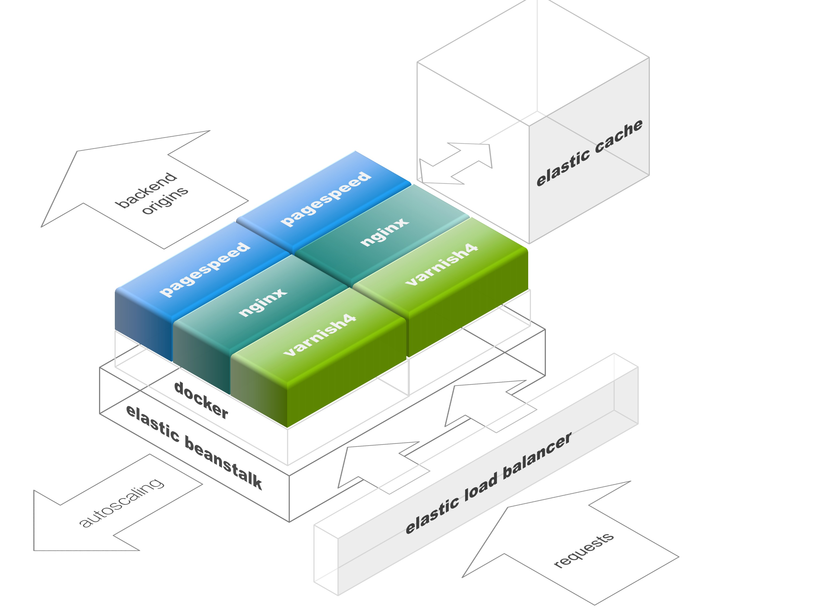

# Google PageSpeed on Docker, with Varnish on top

## What is it?
A docker build of [pagespeed](https://developers.google.com/speed/pagespeed/module/), [nginx](http://nginx.org/) and [varnish 4](https://www.varnish-cache.org/), with some convenient tooling to help developing environment configurations that can be deployed to Amazon Elastic Beanstalk

## Running it
This platform can be run locally, within a docker environment, or on AWS, within [Elastic Beanstalk](https://aws.amazon.com/elasticbeanstalk/). Typically you will testing a configuration in local, and then deploy to AWS.

### Within a local Docker environment
Prerequisites:
- [docker](https://docs.docker.com/installation/)
- [docker-machine](https://docs.docker.com/machine/install-machine/)
- [docker-compose](https://docs.docker.com/compose/install/)
- optionally, the [eb cli](http://docs.aws.amazon.com/elasticbeanstalk/latest/dg/eb-cli3-install.html) for deploying to Elastic Beanstalk

Please see the [documentation](https://docs.docker.com/machine/get-started/) on the Docker site on how to create a local development machine, or check this asciicast:

[](https://asciinema.org/a/cprjy7v8xbhdv7hb76f30azji)
#### create machine

Once you have created one, let's say it's called _pagespeed_, run `eval "$(docker-machine env pagespeed)"`. This will configure you terminal session to point to the docker daemon running on your local machine.

Then, you need to have a configuration created in the `configs/local` directory. There are a lof of examples in [here](configs/local), so just take one and rename/change it for your needs. If your configuration is called `myslowsite` then just run:

```bash
$ make run myslowsite
```

If it's the first time you are running this, it will take quite some time, because docker will need to download the base images, compile nginx, a varnish module and then finally start:

[](https://asciinema.org/a/aw0mluaq5bj319k5ndtt0vz8d)
(_first run on local_)

Then open your browser and point to your local machine ip (try `open $(docker-machine ip devlocal)` if you don't know it).
If everything goes as expected, you should see your site loading, with all the optimizations that you have configured.

You can make further changes, and run again, this time it will take just a few seconds:
[](https://asciinema.org/a/2r58y1ocjycoxnbwvjw8f84px)
( _second run is much quicker_)


### On Elastic Beanstalk

This assumes that you know how to [create an application](http://docs.aws.amazon.com/elasticbeanstalk/latest/dg/using-features.deployment.newapp.html) (use the latest docker based option). Once your application is created, you will need to [launch an enviroment] (http://docs.aws.amazon.com/elasticbeanstalk/latest/dg/using-features.environments.html) which will be used by your site.  The makefile will help you to create an environment for each site. 

Make sure your configuration for `myslowsite` is the configs/eb directory.

You can optionally set EB_OPTIONS with the options that you would want to pass to the `eb` command, for instance

```bash
$ export EB_OPTIONS="--region us-east-1 --profile ebuser"
```
Then run

```bash
$ make init myslowsite
```

and answer to the prompts to let Elastic Beanstalk build your application and environment.

Also, you can watch this asciicast:
[](https://asciinema.org/a/1osqlqpnma9jl8pg5sxsh4ypo)
(_init and deploy on Elastic Beanstalk_)

After it's completed (it seems to take less than 10 minutes), you should have a site running at whatever URL you assigned to it. You can deploy your changes anytime, just using run 

```bash 
$ make deploy myslowsite
```
[](https://asciinema.org/a/8bfdnfsz7afij3wuv2ce5a40x)
(_deploy after init is much quicker_)
### Deployment of the CDN on CloudFront

If you want to test integration with CloudFront as a downstream caching layer, you can just run `make cloudfront myslowsite` which will also locate the zone on Route53 and setup the DNS names (as CNAMES to the Elastic Beanstalk environment, and, if you have defined a CDN sharding, the corresponding CNAMES).

[](https://asciinema.org/a/ch4hl3enn9rhdanx5vp23opt2)
(_set up route 53 and cloudfront_)


## Environment variables reference

NAME | DEFAULT VALUE | DESCRIPTION
-----|---------------|------------
AWS_EB_ROLE | aws-elasticbeanstalk-ec2-role | On EB deployments, the instance role assigned for each instance. The default value is what the AWS consoles creates automatically when you use the wizard to run your 'hello world' first app.
AWS_EB_ROOT_VOLUME_SIZE | 30 | On EB deployments, the size of the root volume (in GB) for each instance.
AWS_EW_INSTANCE_TYPE | t2.large |  On EB deployments, the EC2 instance type that you intend to run. The default T2 is plenty for small sites and testing.
BACKEND |  | This is the fully qualified hostname of the site that you want to accelerate. If the HTML pages contain references (as in src urls) to this domain, they will be rewritten with the value of FRONTEND. Also, see ORIGIN
BACKENDS | | If the origin server is doing some kind of domain sharding, where cdn1.mysite.com/js/jsfile.cs and cdn2.mysite.com/css/cssfile.css are really just aliases for www.mysite.com/js or www.mysite.com/css, you can just add here a "*.mysite.com" to indicate that all those domains are really something that PageSpeed can optimize. 
CDN | | A list of domain names (such as cdn1.example.com, cdn2.example.com) that PageSpeed should be using for sharding assets
COOKIES | |  If cookies are really needed for your backend to work, you can list them here. Remember, cookies are really a _bad thing_. But if you need cookieA and cookieB, just specify "cookieA|cookieB" 
FILTERS_ON | | A white space delimited list of PageSpeed settings that you want to activate for your site. 
FILTERS_OFF | | A white space delimited list of PageSpeed settings that you want to de-activate for your site. 
FILTERS_ENABLED |  | A white space delimited list of filters to enable
FILTERS_DISABLED | | A white space delimited list of filters to disable
CUSTOM_SETTINGS | | Custom setting for PageSpeed that are not just "on" or off". For instance, "pagespeed MaxSegmentLength 250;". Note that in this case, you will need to respect the full syntax for PageSpeed.
FRONTEND | SERVER_NAME | This is the domain that you will use, facing the internet. Typically, www.example.com. If not provided, it will fall back to SERVER_NAME
GRACE | 3600 | A time period in seconds, for which PageSpeed will serve "graced" responses, i.e. responses that are expired, while a new response is fetched and cached in the background
HEALTCHECK | / |  The path that will be used by both Varnish and Elastic Beanstalk to determine the health status. It needs to be returning a 2xx response code, so if "/" returns a 301, use the value of the Location header in the response instead (say, /home.html).
HIDE_PROXY_HEADERS | | If set (to any value) will direct PageSpeed to ignore all the response headers related to caching from any proxied resource. Also see PROXY_DOMAINS
HIDE_BACKEND_HEADERS | | If set (to any value) will direct PageSpeed to ignore all the response headers related to caching from ORIGIN or BACKEND
IF_DESKTOP | | Direct PageSpeed to optionally send additional headers to ORIGIN or BACKEND if the request is detected as coming from a desktop browser. For instance a value could be "Cookie: DeviceType=desktop"
IF_MOBILE | | Same as IF_DESKTOP, but for mobile devices. The detection is done in VCL, and also supports CloudFront device detection headers
MAXAGE | 120 | Sets the max-age Cache-Control header for requests that have been deemed to have already been optimized enough to be cached on downstream caches (such a CloudFront) 
MAX_DOWNSTREAM_AGE | the BACKEND response max-age, or TTL | For requests that are deemed to be already fully optimized, sets a max-age for downstream caches
MAX_REQUESTS | 256 | Maximum number of requests that are accepted from the same client (using X-Forwarded resolution)
MEMCACHED | | Optionally provide the ip address of a Memcached server listening on port 11211 (for instance an Elastic Cache server. If provided, a rule will be added to the security group for Elastic Cache to allow connections from your Elastic Beanstalk environment. 
MINAGE | 60 | The treshold time in seconds after wich a response will be deemed to be already sufficiently optimized to be cached on downstream servers
NGINX_CUSTOM_OPTIONS | | If provided, adds custom commands to the nginx location that serves responses from the BACKEND. It can be used to, for instance, use the substitution module to inject code in the page
ORIGIN | | If provided, will direct PageSpeed to send requests to it instead of BACKEND, and set the Host: header to the value of BACKEND. If your external domain name is www.example.com, but your origin is origin.example.com, you will set BACKEND to www.example.com and ORIGIN to origin.backend.com
PROXY_DOMAINS | | This is a white space delimited list of domains that your site is fetching resources from. Third party JS, CSS, images. They all go there. The resources they are serving will be optimized and served from www.mysite.com/_assets/the.other.domain
PROXY_HTTPS_DOMAINS | | Same as PROXY_DOMAINS, but for resources that can be served only on https.
PAGESPEED | on | Can be used to optionally turn PageSpeed completely off, therefore acting as a simple reverse proxy
PROXY_PATH | _assets | When resources in PROXY_DOMAINS or HTTPS_PROXY_DOMAINS are rewritten in the FRONTEND uri space, their url is constructed as _assets/plain/domain/path to avoid clashes within the uri space. If /_assets/ is already used by your site, the value can be changed to avoid conflicts
RESIZE_PATH | _resize | Allows on the flight resizing of images (jpg only). The image must resized in one of the authorized domains, and the resized url would for instance _resize/[width]x[height]/www.example.com/images/big.jpg. [width] and [height] are expressed in pixels and can be set to - if the resize should not constrain that dimension. Since the result image will also be optmized by PageSpeed, conversion to webp and quality can be set with PageSpeed options  
REWRITE_LEVEL| CoreFilters | Set the PageSpeed [rewrite level](https://developers.google.com/speed/pagespeed/module/config_filters) 
SERVER_NAME | | The fully qualified hostname where you are running PageSpeed. It can be your local docker-machine ip address, the elastic beanstalk server, or any other name that you have assigned to it.
TTL | 120 | The time period, in seconds, for which PageSpeed will keep cached responses in Varnish cache
MAX_UPSTREAM_AGE | 120 | If HIDE_PROXY_HEADERS or HIDE_BACKEND_HEADERS are set, and the response is not allowing caching (for instance, with max-age=0), force PageSpeed to instead consider the response cacheable for this amount of time.
VARNISH_UNSET_RESPONSE_HEADERS | | A list of header names in the response that you don't want to send back
WARMER_URL | | If provided, will start a cache warming script recursively crawling pages at the given URL (typically the home page).  
WARMLY_LIMIT | 1 | The number of levels of recursion for the cache warming script
WARMLY_REJECT | txt, xml, json, rss, atom, jpg, jpeg ,gif, png, mp4, js, css | File extensions that should not be crawled
WARMLY_WAIT_NEXT_RUN | 900 | Number of seconds between a crawl run and the next
WARMLY_WAIT_SECONDS_BETWEEN_REQUESTS | 0.5 | Number of seconds between an http request and the next for each crawl

